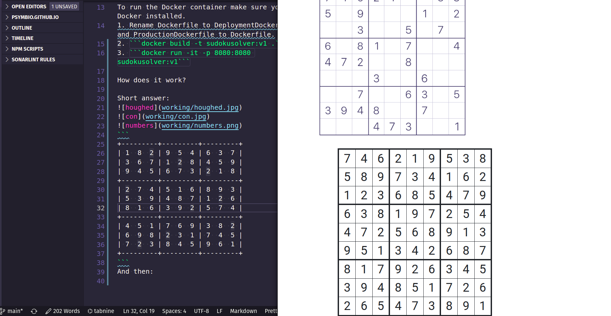

# Sudoku Solver:v1

A sudoku solver in Django, Keras, and OpenCV


To run the plain vanilla Django version:
1. ```git clone https://github.com/psymbio/sudoku-solver-v1.git``` 
2. ```cd sudoku-solver-v1```
3. ```pip install -r requirements.txt```
4. ```python3 manage.py runserver```

To run the Docker container make sure you have Docker installed.
1. Rename Dockerfile to DeploymentDockerfile and ProductionDockerfile to Dockerfile.
2. ```docker build -t sudokusolver:v1 .```
3. ```docker run -it -p 8080:8080 sudokusolver:v1```

How does it work?

Short answer:


```
+---------+---------+---------+
| 1  8  2 | 9  5  4 | 6  3  7 |
| 3  6  7 | 1  2  8 | 4  5  9 |
| 9  4  5 | 6  7  3 | 2  1  8 |
+---------+---------+---------+
| 2  7  4 | 5  1  6 | 8  9  3 |
| 5  3  9 | 4  8  7 | 1  2  6 |
| 8  1  6 | 3  9  2 | 5  7  4 |
+---------+---------+---------+
| 4  5  1 | 7  6  9 | 3  8  2 |
| 6  9  8 | 2  3  1 | 7  4  5 |
| 7  2  3 | 8  4  5 | 9  6  1 |
+---------+---------+---------+
```
And then:


Long answer: <https://psymbio.github.io/posts/sudoku/>

I still am working on it, if you know how I can implement solving sudokus through a ML based approach, you should probably email me before all my hair falls out.

And if you can deploy it, please do.